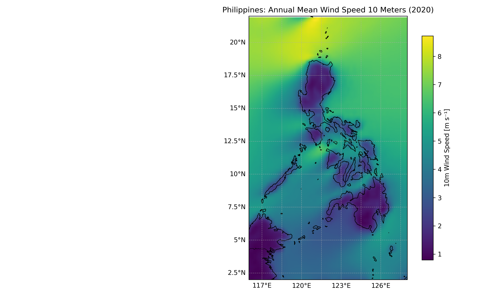
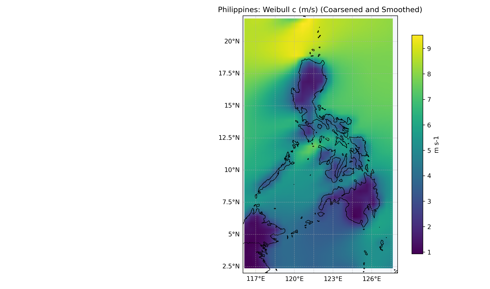
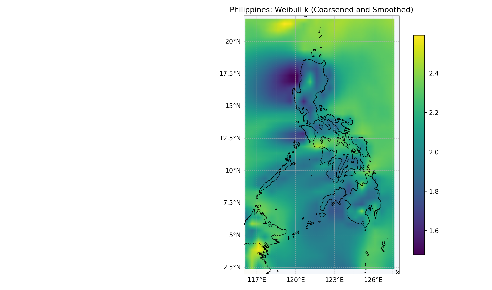

# Philippines Wind Resource & Extreme Wind Analysis (2019–2023)

## Overview

Wind climatology and Weibull modeling using ERA5 reanalysis data.

---

## Annual Mean Wind Speed

---

## Weibull Scale Parameter (c)

---

## Weibull Shape Parameter (k)

---

## Top 20 Wind Resource Locations

